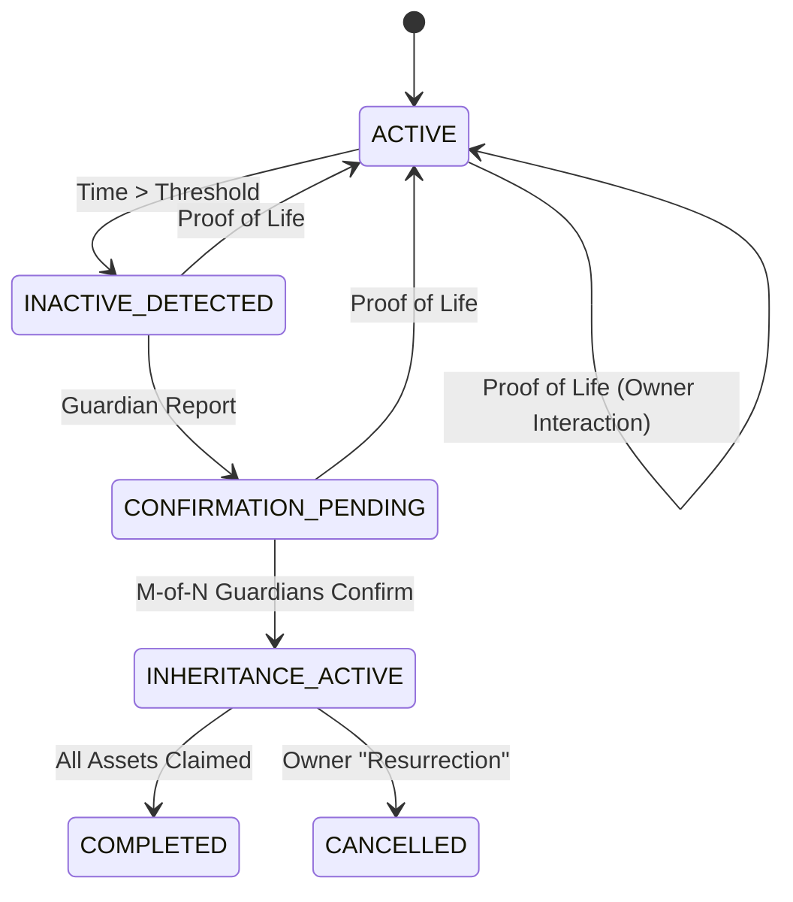

# AfterLife | Temporal Asset Protocol ⏳⚖️

AfterLife is a decentralized "dead man's switch" protocol with **multi-chain support** on **Arbitrum Sepolia** and **Mantle Sepolia**. It ensures your digital assets are securely distributed to beneficiaries if you become inactive for a defined period, verified by a distributed network of guardians.

## 🌟 Key Features

- **🔗 Multi-Chain Support:** Deploy and manage your inheritance across Arbitrum and Mantle networks independently.
- **Multi-Tenant Protocol:** Every user has their own isolated inheritance logic within a single master contract.
- **Heartbeat Verification:** Owners prove "liveliness" through simple on-chain interactions.
- **Guardian Consensus:** Trusted entities (Guardians) can trigger the inheritance process if the heartbeat threshold is exceeded.
- **Progressive Vesting:** Supports both **Linear** and **Cliff** vesting schedules for beneficiaries.
- **Premium UI:** A high-end, glassmorphic dashboard built with React, Framer Motion, and Three.js.

---

## 🌌 System Overview

AfterLife is a decentralized inheritance protocol that uses time as a neutral executor. It operates on a **"Dead Man's Switch"** principle: lack of activity from the owner triggers a state change that eventually unlocks assets for beneficiaries.

### High-Level Components
1.  **Smart Contract (Multi-Chain)**: The "Executor". Holds logic, state, and permissions.
2.  **Frontend (React/Vite)**: The "Interface". Connects users (Owner, Guardians, Beneficiaries) to the contract.
3.  **L2 Networks**: Provides security, low fees, and timestamp validity.

---

## 🏗️ Architecture & System Design

### 1. Smart Contract Entities

| Entity | Role | Capabilities |
| :--- | :--- | :--- |
| **Owner** | The Asset Holder | Initialize Will, Add/Remove Guardians/Beneficiaries, Prove Life (Reset Timer), Cancel Inheritance. |
| **Guardian** | The Oracle of Silence | Verify inactivity when threshold is met. Cannot withdraw funds. |
| **Beneficiary** | The Receiver | Claim unlocked assets after the vesting period begins. |

### 2. State Machine Logic

The protocol operates as a finite state machine to ensure security and owner control.



### 3. Core Stack
- **Smart Contracts:** Solidity (Deployed on Arbitrum Sepolia & Mantle Sepolia)
- **Frontend:** React + Vite + TypeScript
- **Web3 Integration:** Wagmi + Viem + TanStack Query
- **Styling:** Tailwind CSS + Custom Glassmorphism Engine
- **Animations:** Framer Motion + GSAP

### 4. Deployed Contracts

| Network | Chain ID | Contract Address | Explorer |
|---------|----------|------------------|----------|
| **Arbitrum Sepolia** | 421614 | `0xA39F43685807dD2155b01C404083a43834B98840` | [View on Arbiscan](https://sepolia.arbiscan.io/address/0xA39F43685807dD2155b01C404083a43834B98840) |
| **Mantle Sepolia** | 5003 | `0x8fD3A16F905dF98907B3739bCD0E31a7949cd2D2` | [View on Mantlescan](https://explorer.sepolia.mantle.xyz/address/0x8fD3A16F905dF98907B3739bCD0E31a7949cd2D2) |

**Platform Fee:** 10% on all beneficiary claims

---

## 🛡️ Security & Resilience

### 1. Security Model
- **Owner Override**: The owner can call `proveLife` at ANY time to cancel the inheritance process and reclaim full control.
- **Vesting Delay**: Funds are not released instantly. The `vestingDuration` provides a safety window for the owner to notice unauthorized guardian actions.
- **Guardian Isolation**: Guardians can only confirm inactivity; they have zero permissions to move or withdraw funds.

### 2. Resilience Measures
The protocol is optimized for stable interaction:
- **Forced Gas Limits:** Uses a 1,000,000 gas buffer to bypass Arbitrum's estimation errors.
- **RPC Reliability:** Uses official and highly resilient RPC endpoints to avoid rate limits.
- **Fail-Safe Write:** Gracefully handles RPC simulation failures by falling back to direct blockchain writing.

---

## 🛠️ Getting Started

### Prerequisites
- [pnpm](https://pnpm.io/)
- [MetaMask](https://metamask.io/) with Arbitrum Sepolia configured.

### Installation
1. Clone the repository
2. Install dependencies:
   ```bash
   pnpm install
   ```
3. Run the development server:
   ```bash
   pnpm run dev
   ```

### Deployment (Build)
To generate production-ready files:
```bash
pnpm build
```

---

## 📘 User Guide

### 1. Owner Workflow
- **Register:** Initialize your protocol by setting an inactivity threshold (e.g., 30 days).
- **Add Guardians:** Assign trusted wallets to monitor your status.
- **Configure Beneficiaries:** Set wallet addresses and their percentage of your vault.
- **Prove Life:** Click "Prove Life" periodically to reset your heartbeat timer.

### 2. Guardian Workflow
- Monitor the owner's status.
- If the threshold is exceeded, the Guardian can "Confirm Inactivity" to begin asset distribution.

### 3. Beneficiary Workflow
- Once the protocol is in the "Executing" state, beneficiaries can claim their allocated assets based on the vesting schedule.

---

---


